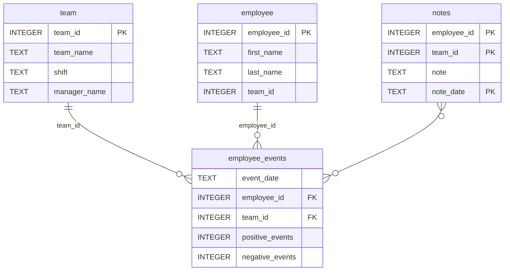

# Data Science Dashboard 

[](https://github.com/SA-Sean/dsnd-dashboard-project/actions/workflows/test.yml)

This repository contains code and resources to run a basic web dashboard showing Employee and Team events, classified as either a 'positive' or 'negative' event. The web dashboard is generated using [FastHTML](https://www.fastht.ml/). Additionally the repository contains code and a model for predicting the likely hood of an employee to be recruited, also displayed on dashboard.

## Created
- Project created: January 2026
- Readme updated: 08 February 2026

## Dependencies
You will need <code>python</code> along with the 'standard' data science related libraries we all know and love to run the <code>dashboard</code> as well as some you may not have yet used

Libraries we know

- [python-fasthtml](https://www.fastht.ml/)
- numpy
- pandas
- matplotlib
- scikit learn
- scipy==1.14.1
- pytest
- flake8
- ipython

### Employee Events package
Additionally a custom python package called <code>employee_events</code> is bundled with the repository and needs to be installed on your environment to run the dashboard

Building and installing the 'employee_event' package:

- in your terminal navigate to the 'python-package' folder in your repo
- run the command: <code>python setup.py sdist</code> to build the package
- run the command <code>python -m pip install dsit/employee_events-0.0.5.tar.gz</code> to install the package


### Repository Structure
```
├── README.md
├── assets
│   ├── model.pkl
│   └── report.css
├── env
├── python-package
│   ├── employee_events
│   │   ├── __init__.py
│   │   ├── employee.py
│   │   ├── employee_events.db
│   │   ├── query_base.py
│   │   ├── sql_execution.py
│   │   └── team.py
│   ├── requirements.txt
│   ├── setup.py
├── report
│   ├── base_components
│   │   ├── __init__.py
│   │   ├── base_component.py
│   │   ├── data_table.py
│   │   ├── dropdown.py
│   │   ├── matplotlib_viz.py
│   │   └── radio.py
│   ├── combined_components
│   │   ├── __init__.py
│   │   ├── combined_component.py
│   │   └── form_group.py
│   ├── dashboard.py
│   └── utils.py
├── requirements.txt
├── start
├── tests
    └── test_employee_events.py
```

### SQLite Database Structure: employee_events.db 



## Running the dashboard 📊

In your terminal navigate to the 'reports' folder of your repo.

- run the command <code>python dashboard.py</code>
- enter the url <code>localhost:5001</code> into a web browser on your local machine


## Credits 🤝
A huge thanks to the Udacity teams without whom this project would not have been possible.

## License 📜
As per License.txt file.

We ❤️ [Udacity!](https://udacity.com)

